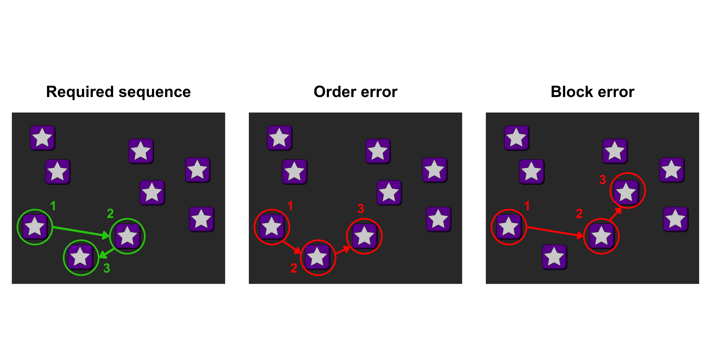
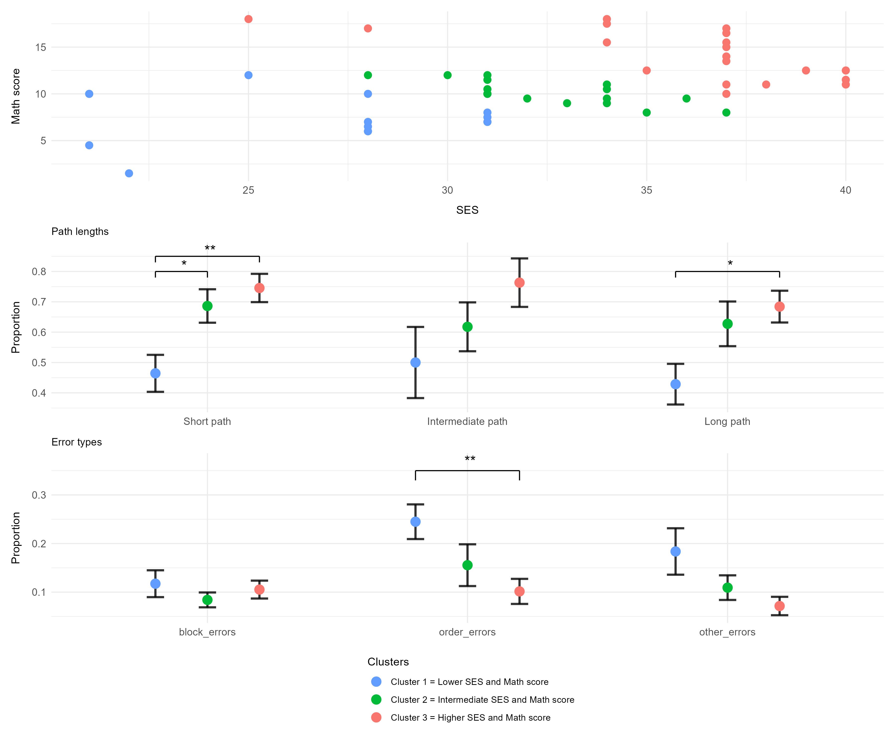

<style>

#main-img-left {
  position: absolute;
  top: 50%;
  left: 23%;
  transform: translate(-50%, -50%);
  width: 40%;   /* ajustá el tamaño del logo */
  object-fit: contain;
  overflow: hidden;   /* que no se salga */
  max-height: 50%;   /* asegurás que no “empuje” */
}

#main-img-right {
  position: absolute;
  right: 3%;
  top: 20%;
  width: 220px;
  height: 220px;
  object-fit: contain;
  overflow: hidden;   /* que no se salga */
  max-height: 90%;   /* asegurás que no “empuje” */
}
</style>


```{r, include=FALSE}

## Paquetes

library(qrcode)
library(dplyr)
library(rsvg)
library(ggplot2)

## Opciones

knitr::opts_chunk$set(echo = FALSE,
                      warning = FALSE,
                      tidy = FALSE,
                      message = FALSE,
                      fig.align = 'center',
                      out.width = "100%")

options(knitr.table.format = "html") 

## Código QR

# qr_code("https://github.com/FedeGiovannetti/Poster_AACC_2025", ecl = "H") %>%
#   generate_svg("QR_Poster_AACC_2025.svg", foreground = "white", background = "transparent")
# 
# rsvg_png("QR_Poster_AACC_2025.svg", "QR_Poster_AACC_2025.png", width = 1000, height = 1000)

```

<span style="display: block; margin-top: -5px;">

## 1. Background

<span style="font-size:30px; font-weight:normal;">
Evidence links socioeconomic status (SES) to cognitive development and academic performance (Noble & Giebler, 2020). Working memory (WM) is proposed as a mediator (Waters et al., 2020). Research often relies on global performance, which may limit the capture of cognitive diversity in developmental pathways. Exploring specific task parameters and error types could reveal distinct subgroups for targeted interventions.
</span>

```{r, include=FALSE}
knitr::write_bib(c('posterdown', 'rmarkdown','pagedown','dplyr','ggplot2','base','diceR'), 'packages.bib')

cat(
"
@Manual{RStudio,
  title = {RStudio: Integrated Development Environment for R},
  author = {{RStudio Team}},
  organization = {RStudio, PBC},
  address = {Boston, MA},
  year = {2024},
  url = {http://www.rstudio.com/},
}",
file = "packages.bib",
append = TRUE
)
```

## 2. Purpose

<span style="font-size:35px; font-weight:bold;">

Implement unsupervised clustering to examine associations between SES and academic performance. Children with distinct profiles will exhibit differing WM response patterns.

</span>

## 3. Methods

<span style="font-size:30px; font-weight:normal;">
Fifty-one 5-year-olds completed a Corsi task and the Woodcock-Muñoz math subscale; caregivers provided SES information. Associations were examined via multiple regression and bootstrapped mediation analyses. Children were clustered (PAM), and response patterns were compared between groups using Kruskal-Wallis and corrected post-hoc tests. Analyses were conducted in R (2025).
</span>


## Resultados

Se seleccionó un número final de k=3 mediante K-medias y PAM. Los grupos difirieron significativamente entre sí en todas las tareas (p <.05), mostrando similitudes y diferencias para cada muestra. 

- <span style="color:#619CFF; font-weight:bold;">Clúster 1</span> presentó desempeños y tiempos de reacción (TR) bajos en CI en ambas muestras. Para MT, mostró desempeños bajos en la muestra A y altos en la muestra B.<br>
- <span style="color:#00BA38; font-weight:bold;">Clúster 2</span> presentó desempeños medios en CI en ambas muestras, con RT altos en la muestra A, acompañados de desempeños bajos en PL.<br>
- <span style="color:#F8766D; font-weight:bold;">Clúster 3</span> tuvo desempeños medios-altos en CI y PL en ambas muestras. En los TR de CI, presentó TR bajos en la muestra A, y altos en la muestra B. <br>

<span style="display: block; margin-top: -5px;">


<div style="height:50px;"></div>

## Conclusiones

- Los métodos de agrupamiento permitieron identificar perfiles heterogéneos entre y dentro de las muestras. 
- Estos resultados contribuyen al desarrollo de un enfoque metodológico relevante en el contexto de intervenciones que contemplen la diversidad cognitiva infantil.


### Referencias
<span style="display: block; margin-top: -3px;">

::: {#refs}
:::

<div style="height:1150px;"></div>

<figure style="width:200%; margin:0 auto; text-align:center;">
  
  <figcaption>
  <span style="font-weight:bold;">Figura 1.</span> 
  Comparación los desempeños y tiempos de reacción de los clústeres<br>generados para cada muestra (valores z).* p<0.05; ** p<0.01; *** p<0.001.
  </figcaption>
</figure>


```{r, fig.height= 6, fig.width=12, echo=FALSE}
library(knitr)
library(gridExtra)
library(grid)
library(magick)


vp_A <- viewport(
 x = 0.5, y = 0.5, width = 0.9, height = 0.95,
 just = c("center", "center")
)
# 'vp_B' will take up the bottom half with some top margin
vp_B <- viewport(
 x = 0.5, y = 0.5, width = 0.9, height = 0.95,
 just = c("center", "center")
)

vp_C <- viewport(
 x = 0.5, y = 0.5, width = 0.9, height = 0.95,
 just = c("center", "center")
)


 
required_sequence_img <- rasterGrob(image_read("img/Required_sequence.png"), vp = vp_A)
order_error_img <- rasterGrob(image_read("img/order_error.png"), vp = vp_B)
block_error_img <- rasterGrob(image_read("img/block_error.png"), vp = vp_C) 
 
 figura_2 <- arrangeGrob(
   required_sequence_img,
   order_error_img,
   block_error_img,
   ncol = 3
 )

 
 


 ggsave("Figuras/Figura_errores.png", figura_2, width = 12, height = 6, units = "in")


```

 <figure style="width:200%; margin:0 auto; text-align:center;">
   
  <figcaption>
  <span style="font-weight:bold;">Figura 2.</span>
  Imágenes de las inmediaciones del barrio donde habitaban    <br>
  los/as participantes de las muestras A y B respectivamente.
  </figcaption>
</figure>


```{r figura_2_guardar, include=FALSE,  fig.width = 12, fig.height = 10}
library(patchwork)
library(ggplot2)


SES_math_clusters_plot <- readRDS("Figuras/SES_math_clusters_plot.Rds") +
  theme(legend.position = "none")

path_cluster_plot <- readRDS("Figuras/path_cluster_plot.Rds") +
  theme(legend.position = "none")

errors_cluster_plot <- readRDS("Figuras/errors_cluster_plot.Rds") +
  theme(legend.position = "none")


legend <- readRDS("Figuras/legend.rds")

(SES_math_clusters_plot / path_cluster_plot/ errors_cluster_plot/ legend)+ 
  plot_layout(heights = c(3, 3, 3, 1.5))

  plot_layout(guides = 'collect') &
  theme(legend.position = 'bottom', legend.text = element_text(size =10))
# Leyenda desde uno de los plots
leyenda <- ggpubr::get_legend(
  path_cluster_plot + theme(legend.position = "bottom", legend.direction = "vertical")
) %>% wrap_elements()

# Patchwork
figure_1 <- (SES_math_clusters_plot / path_cluster_plot / errors_cluster_plot / leyenda) + 
  plot_layout(heights = c(3, 3, 3, 1.5))
# 
ggsave("Figuras/Figura_1_poster.png", figure_1, width = 12, height = 10, units = "in")
# 
# 
# p


```

<figure style="width:200%; margin:0 auto; text-align:center;">
  
  <figcaption>
  <span style="font-weight:bold;">Figura 1.</span> 
  Comparación los desempeños y tiempos de reacción de los clústeres<br>generados para cada muestra (valores z).* p<0.05; ** p<0.01; *** p<0.001.
  </figcaption>
</figure>
  

