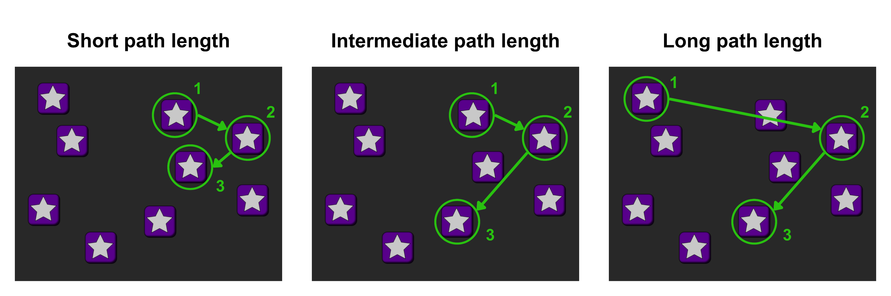

<style>

.poster_body, #content {
    padding-left: 40cm !important; /* Adjust this to widen the left margin */
    padding-right: 2cm !important; /* Optional: adds breathing room on the right */
}

#main-img-left {
  position: absolute;
  top: 50%;
  left: 23%;
  transform: translate(-50%, -50%);
  width: 40%;   /* ajustá el tamaño del logo */
  object-fit: contain;
  overflow: hidden;   /* que no se salga */
  max-height: 50%;   /* asegurás que no “empuje” */
}

#main-img-right {
  position: absolute;
  right: 3%;
  top: 20%;
  width: 220px;
  height: 220px;
  object-fit: contain;
  overflow: hidden;   /* que no se salga */
  max-height: 90%;   /* asegurás que no “empuje” */
}

.author_extra {
  margin-left: 40px;
  margin-right: 40px;
}

#affiliation {
  margin-left: 40px;
  margin-right: 40px;
}
</style>


```{r, include=FALSE}

## Paquetes

library(qrcode)
library(dplyr)
library(rsvg)
library(ggplot2)

## Opciones

knitr::opts_chunk$set(echo = FALSE,
                      warning = FALSE,
                      tidy = FALSE,
                      message = FALSE,
                      fig.align = 'center',
                      out.width = "100%")

options(knitr.table.format = "html") 

## Código QR
# 
# qr_code("https://github.com/FedeGiovannetti/Poster_ISSBD_2026_beyond_accuracy_scores", ecl = "H") %>%
#   generate_svg("QR_Poster_ISSBD_2026.svg", foreground = "white", background = "transparent")
# 
# rsvg_png("QR_Poster_ISSBD_2026.svg", "QR_Poster_ISSBD_2026.png", width = 1000, height = 1000)

```

<span style="display: block; margin-top: -5px;">

### 1. Background

<div style="margin-left: 10px; margin-right: -40px;">
<span style="font-size:35px; font-weight:normal;">
Evidence links socioeconomic status (SES) to cognitive development and academic performance (Noble & Giebler, 2020). Working memory (WM) is proposed as a mediator (Waters et al., 2020). Research often relies on global performance, which may limit the capture of cognitive diversity in developmental pathways. Exploring specific task parameters and error types could reveal distinct subgroups for targeted interventions.
</span>
</div>

```{r, include=FALSE}
knitr::write_bib(c('posterdown', 'rmarkdown','pagedown','dplyr','ggplot2','base','diceR'), 'packages.bib')

cat(
"
@Manual{RStudio,
  title = {RStudio: Integrated Development Environment for R},
  author = {{RStudio Team}},
  organization = {RStudio, PBC},
  address = {Boston, MA},
  year = {2024},
  url = {http://www.rstudio.com/},
}",
file = "packages.bib",
append = TRUE
)
```

### 2. Purpose

<div style="margin-left: 10px; margin-right: -40px;">
<span style="font-size:35px; font-weight:normal;">

To implement an unsupervised clustering analysis to examine associations between SES and academic performance. Children with distinct profiles will exhibit differing WM response patterns.

</span>

</div>

### 3. Methods

<div style="margin-left: 10px; margin-right: -40px;">

<span style="font-size:35px; font-weight:normal;">
Fifty-one 5-year-olds completed a Corsi task and the Woodcock-Muñoz math subscale; caregivers provided SES information. Associations were examined via multiple regression and bootstrapped mediation analyses. Children were clustered (PAM), and response patterns were compared between groups using Kruskal-Wallis and corrected post-hoc tests. Analyses were conducted in R (2025).
</span>

</div>

### 4. Results

```{r}

Model_A <- readRDS("models/model_A.Rds")
Model_B <- readRDS("models/model_B.Rds")

```


<div style="margin-left: 10px; margin-right: -40px;">

<span style="font-size:35px; font-weight:normal;">

**4.1. Regression and mediation analyses**

**Model A** included Working memory accuracy as outcome variable, with Age and SES as predictor variables. **Model B** included Math performance and WM accuracy as well as **Age** as predictors. SES, WM, and math performance were associated (*β* > `r round(min(Model_A$estimate[3], Model_B$estimate[3]), digits = 3)`; *p* < .001), after controlling for the effect of age. Non-parametric bootstrap mediation analysis showed that working memory mediated SES’s effect on math performance (β = 0.21; p < .001), making the direct effect disappeared.

**4.2. Task parameter and Error analysis**

We were interested in studying which specific aspects of performance in CORSI might be relevant in the found associations.nWe studied the role of the **maximum achieved level**, performance in trials with **short, intermediate and long path lengths**, and the different types of errors committed by participants (namely **order errors, block errors, and other errors**).

The different parameters of the task showed distinct associations with the global score in the sense that none of them alone seems to explain all changes in global score, with short and long paths showing the higher estimates. The different error types also showed such associations, with order errors having the higher estimate value.

**4.3. Cluster analysis**

A *k* = 3 was selected and the clustering algorithm was implemented using only SES and math score as features, resulting in the following clusters:

- <span style="color:#619CFF; font-weight:bold;">Clúster 1</span> contains the children with Lower SES and Math score values in average <br>
- <span style="color:#00BA38; font-weight:bold;">Clúster 2</span> contains the children with Intermediate SES and Math score values in average <br>
- <span style="color:#F8766D; font-weight:bold;">Clúster 3</span>  contains the children with Higher SES and Math score values in average <br>

These groups showed statistically significant differences in maximum level, performance in short and long trials, and the incidence of order errors (H > 7.484; p <.02).

<!-- <span style="display: block; margin-top: -5px;"> -->

</div>

<!-- <div style="height:50px;"></div> -->

### 5. Conclusions

<div style="margin-left: 10px; margin-right: -40px;">
<span style="font-size:35px; font-weight:normal;">

Specific response patterns were related to children's SES and math performance, which may reflect distinct developmental pathways. Results may contribute to designing more inclusive interventions and policies that offer different activities for children with specific processing needs.

</span>

</div>

### 6. References
<span style="display: block; margin-top: -3px;">

::: {#refs}
:::

<figure style="width:200%; margin: 0 auto; text-align:center;"> 
<!-- <figure style="width:200%; margin: 0 auto; padding-top: 60px; text-align:center;">  -->
  
  <figcaption style="margin-top: 15px;">
  <span style="font-weight:bold;">Figure 1.</span> 
  Research assistants administering computerized cognitive tasks in the school.
  </figcaption>
</figure>

```{r, fig.height= 6, fig.width=12, echo=FALSE}
library(knitr)
library(gridExtra)
library(grid)
library(magick)


vp_A <- viewport(
 x = 0.5, y = 0.5, width = 0.9, height = 1,
 just = c("center", "center")
)
# 'vp_B' will take up the bottom half with some top margin
vp_B <- viewport(
 x = 0.5, y = 0.5, width = 0.9, height = 1,
 just = c("center", "center")
)

vp_C <- viewport(
 x = 0.5, y = 0.5, width = 0.9, height = 1,
 just = c("center", "center")
)


 
short_img <- rasterGrob(image_read("img/Short path length.png"), vp = vp_A)
mid_img <- rasterGrob(image_read("img/Intermediate path length.png"), vp = vp_B)
long_img <- rasterGrob(image_read("img/Long path length.png"), vp = vp_C) 
 
 figura_2 <- arrangeGrob(
   short_img,
   mid_img,
   long_img,
   ncol = 3
 )

 
ggsave("Figuras/Figura_path.png", figura_2, width = 12, height = 4, units = "in")


```

 <figure style="width:200%; margin:-10 auto; text-align:center;">
   
  <figcaption>
  <span style="font-weight:bold;">Figure 2.</span>
  The three different path lengths included in Corsi task.
  </figcaption>
</figure>

```{r, fig.height= 6, fig.width=12, echo=FALSE}
library(knitr)
library(gridExtra)
library(grid)
library(magick)


vp_A <- viewport(
 x = 0.5, y = 0.5, width = 0.9, height = 1,
 just = c("center", "center")
)
# 'vp_B' will take up the bottom half with some top margin
vp_B <- viewport(
 x = 0.5, y = 0.5, width = 0.9, height = 1,
 just = c("center", "center")
)

vp_C <- viewport(
 x = 0.5, y = 0.5, width = 0.9, height = 1,
 just = c("center", "center")
)


 
required_sequence_img <- rasterGrob(image_read("img/Required_sequence.png"), vp = vp_A)
order_error_img <- rasterGrob(image_read("img/order_error.png"), vp = vp_B)
block_error_img <- rasterGrob(image_read("img/block_error.png"), vp = vp_C) 
 
 figura_2 <- arrangeGrob(
   required_sequence_img,
   order_error_img,
   block_error_img,
   ncol = 3
 )

 
ggsave("Figuras/Figura_errores.png", figura_2, width = 12, height = 4, units = "in")


```

 <figure style="width:200%; margin:-10 auto; text-align:center;">
   
  <figcaption>
  <span style="font-weight:bold;">Figura 3.</span>
  The three different error types differentiated from participant's responses.
  </figcaption>
</figure>


```{r figura_2_guardar, include=FALSE,  fig.width = 12, fig.height = 10}
library(patchwork)
library(ggplot2)


SES_math_clusters_plot <- readRDS("Figuras/SES_math_clusters_plot.Rds") +
  theme(legend.position = "none")

path_cluster_plot <- readRDS("Figuras/path_cluster_plot.Rds") +
  theme(legend.position = "none")

errors_cluster_plot <- readRDS("Figuras/errors_cluster_plot.Rds") +
  theme(legend.position = "none")


legend <- readRDS("Figuras/legend.rds")

# (SES_math_clusters_plot / path_cluster_plot/ errors_cluster_plot/ legend)+ 
#   plot_layout(heights = c(3, 3, 3, 1.5))
# 
#   plot_layout(guides = 'collect') &
#   theme(legend.position = 'bottom', legend.text = element_text(size =10))
# # Leyenda desde uno de los plots
# leyenda <- ggpubr::get_legend(
#   path_cluster_plot + theme(legend.position = "bottom", legend.direction = "vertical")
# ) %>% wrap_elements()

# (# Patchwork
# (
figure_1 <- (SES_math_clusters_plot / path_cluster_plot / errors_cluster_plot / legend) + 
  plot_layout(heights = c(5, 3, 3, 1.5))&
        theme(
          axis.title.x = element_blank(),
          axis.title.y = element_text(margin = margin(r = 10), size = 15),
          plot.title = element_text(size = 20, face = "bold", margin = margin(b = 20)),
          plot.margin = margin(20, 10, 10, 5)
          )
# )
ggsave("Figuras/Figura_1_poster.png", figure_1, width = 12, height = 10, units = "in")
# 
# 
# p


```

 <!-- <span style="display: block; margin-top: 50px;"> -->

<figure style="width:200%; margin:0 auto; text-align:center;">
  
  <figcaption style="margin-top: 15px;">
  <span style="font-weight:bold;">Figure 4.</span> 
  SES, math score, problem parameters and error types across the three distinct clusters. * p<0.05; ** p<0.01; *** p<0.001.
  </figcaption>
</figure>
  

